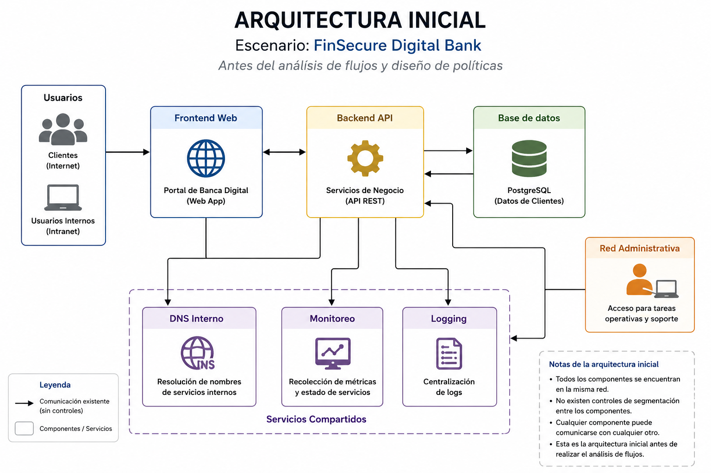
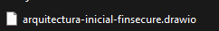
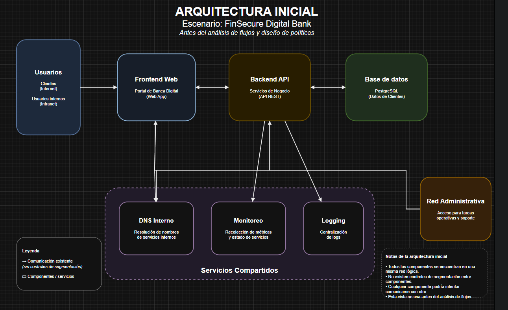
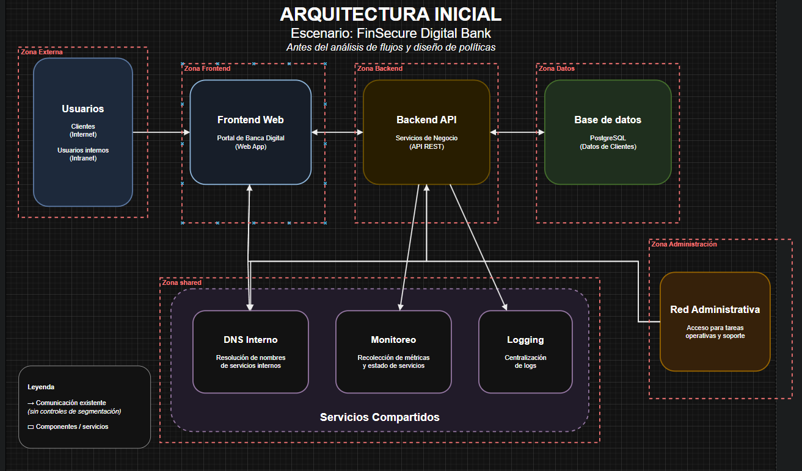
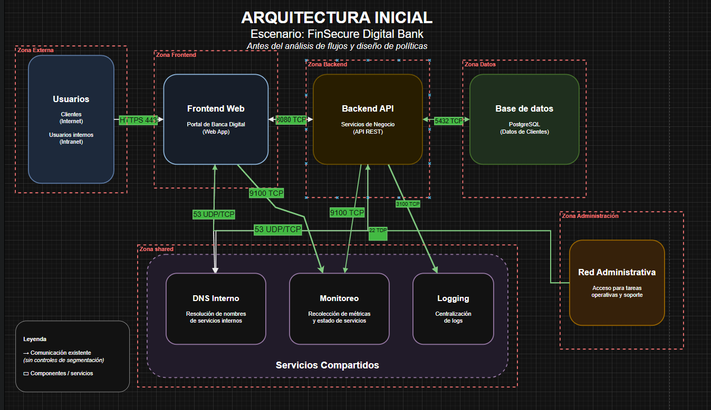
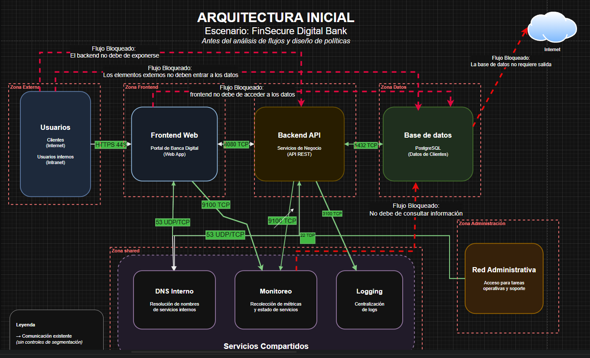
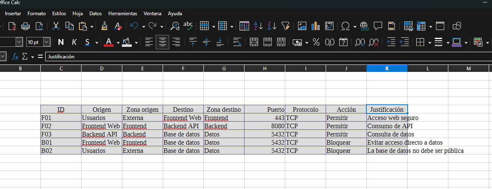
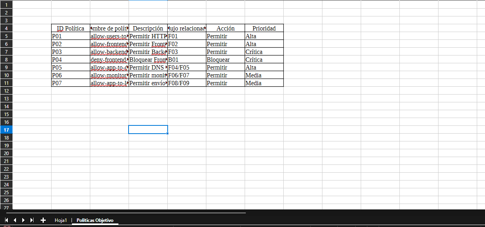

# 1. Mapeo de flujos y diseño de políticas objetivo

La empresa FinSecure Digital Bank está modernizando una aplicación interna de banca digital. La aplicación permite a usuarios consultar información de cuentas, movimientos y operaciones básicas desde un portal web.

El equipo de Seguridad detectó que existe demasiada comunicación interna entre componentes. Aunque la aplicación funciona, existe riesgo de movimiento lateral si un atacante compromete el frontend o algún servicio interno.

Como parte de una iniciativa de Zero Trust y microsegmentación, se solicita diseñar una propuesta de segmentación antes de implementar controles técnicos en Kubernetes o Linux.

## Objetivos
- Identificar componentes de una arquitectura
- Clasificar zonas de seguridad
- Mapear flujos permitidos
- Diseñar políticas alineadas con Zero Trust


---
<!--Este fragmento es la barra de 
navegación-->

<div style="width: 400px;">
        <table width="50%">
            <tr>
                <td style="text-align: center;">
                    <a href=""></a>
                    <br>anterior
                </td>
                <td style="text-align: center;">
                   <a href="../README.md">Lista Laboratorios</a>
                </td>
<td style="text-align: center;">
                    <a href="../Capitulo2/"></a>
                    <br>siguiente
                </td>
            </tr>
        </table>
</div>

---

## Diagrama 

Se espera que el alumno analice la siguiente estructura de aplicación. 




>Nota: Esta arquitectura es antes del análisis de flujo e implementación de políticas. 


## Instrucciones 
>**Nota:** Para este laboratorio usaremos las siguientes herramientas 
- https://app.diagrams.net/ : Para crear la arquitectura

- **Libre Office**: Crear matriz de flujo y políticas de propuesta

- **Markdown**: Para documentar  

## Revisar la arquitectura inicial

1. En la carpeta de  capitulo1, podremos encontrar un archivo con el nombre **arquitectura-inicial-finsecure.drawio**, debemos de descargarlo

2. Abrir la siguiente página web https://app.diagrams.net/:

3. Seleccionar **File->Import From->Device** y abrir el archivo que descargamos. 




4. Al abrir el diagrama deberías de observar lo siguiente:



5. Ahora identifica los siguientes componentes:

```text
Usuarios
Frontend Web
Backend API
Base de datos
DNS interno
Monitoreo
Logging
Red administrativa
```

6. Ahora crear un archivo llamado **reporte.md** donde responderemos:

```md
## Análisis inicial

- ¿Qué componente recibe tráfico de usuarios?
- ¿Qué componente procesa la lógica de negocio?
- ¿Qué componente almacena información sensible?
- ¿Qué servicios compartidos existen?
- ¿Qué riesgos observas en la arquitectura inicial?
```
## Identificar las zonas de seguridad

1. Usando Libre Office crea una tabla usando cómo base la siguiente tabla:


| Componente         | Zona           | Justificación                          |
| ------------------ | -------------- | -------------------------------------- |
| Usuarios           | Externa        | Origen del tráfico hacia la aplicación |
| Frontend Web       | Frontend       | Recibe tráfico de usuarios             |
| Backend API        | Backend        | Procesa lógica de negocio              |
| Base de datos      | Datos          | Almacena información sensible          |
| DNS interno        | Shared         | Servicio compartido de resolución      |
| Monitoreo          | Shared         | Servicio operativo                     |
| Logging            | Shared         | Servicio operativo                     |
| Red administrativa | Administración | Acceso operativo controlado            |


## Crear el diagrama de arquitectura segmentada

1. En **diagrama.net** modifica el diagrama dibujando las siguientes zonas:

```text
Zona Externa
Zona Frontend
Zona Backend
Zona Datos
Zona Shared
Zona Administración
```

> **Nota:**  Para dibujar las zonas correctamente agrega en **diagramas.net** el módulo de **threat modeling** para el dibujo de zonas





## Dibujas los flujos permitidos

1. En el diagrama usa flechas solidad de cólor verde para representar los flujos permitidos también representa los puertos y protocolos de comunicación en el diagrama, usa la siguiente tabla:

| Origen             | Destino          | Puerto | Protocolo | Motivo                    |
| ------------------ | ---------------- | -----: | --------- | ------------------------- |
| Usuarios           | Frontend Web     |    443 | TCP       | Acceso web seguro         |
| Frontend Web       | Backend API      |   8080 | TCP       | Consumo de API            |
| Backend API        | Base de datos    |   5432 | TCP       | Consulta de datos         |
| Frontend Web       | DNS interno      |     53 | UDP/TCP   | Resolución de nombres     |
| Backend API        | DNS interno      |     53 | UDP/TCP   | Resolución de nombres     |
| Monitoreo          | Frontend Web     |   9100 | TCP       | Recolección de métricas   |
| Monitoreo          | Backend API      |   9100 | TCP       | Recolección de métricas   |
| Frontend Web       | Logging          |   3100 | TCP       | Envío de logs             |
| Backend API        | Logging          |   3100 | TCP       | Envío de logs             |
| Red administrativa | Frontend/Backend |     22 | TCP       | Administración controlada |





## Dibujar los flujos bloqueados

1. En el mismo diagrama usa flechas punteadas y rojas para representar los flujos que deben de bloquearse, usar la siguiente tabla de bloqueos sugeridos:

| Origen                   | Destino       |     Puerto | Motivo                                      |
| ------------------------ | ------------- | ---------: | ------------------------------------------- |
| Usuarios                 | Backend API   |       8080 | El backend no debe exponerse directamente   |
| Usuarios                 | Base de datos |       5432 | La base de datos no debe ser pública        |
| Frontend Web             | Base de datos |       5432 | El frontend no debe acceder directo a datos |
| Monitoreo                | Base de datos |       5432 | Monitoreo no debe consultar información     |
| Logging                  | Base de datos |       5432 | Logging no debe acceder a datos             |
| Base de datos            | Internet      | Cualquiera | La base de datos no requiere salida directa |
| Servicios no autorizados | Base de datos |       5432 | Reducir movimiento lateral                  |





>Nota: Al terminar exportar el diagrama resultante en una imagen.


## Crear la matriz de flujos en Libre Office Calc

1. Abri Libre Office Calc y crea el archivo. 

```bash
matriz-flujos.ods
```

2. Agrega las siguientes columnas:

```text
ID
Origen
Zona origen
Destino
Zona destino
Puerto
Protocolo
Acción
Justificación
```

3. Usar la siguiente tabla de ejemplo y mejora si es necesario:

| ID  | Origen       | Zona origen | Destino       | Zona destino | Puerto | Protocolo | Acción   | Justificación                        |
| --- | ------------ | ----------- | ------------- | ------------ | -----: | --------- | -------- | ------------------------------------ |
| F01 | Usuarios     | Externa     | Frontend Web  | Frontend     |    443 | TCP       | Permitir | Acceso web seguro                    |
| F02 | Frontend Web | Frontend    | Backend API   | Backend      |   8080 | TCP       | Permitir | Consumo de API                       |
| F03 | Backend API  | Backend     | Base de datos | Datos        |   5432 | TCP       | Permitir | Consulta de datos                    |
| B01 | Frontend Web | Frontend    | Base de datos | Datos        |   5432 | TCP       | Bloquear | Evitar acceso directo a datos        |
| B02 | Usuarios     | Externa     | Base de datos | Datos        |   5432 | TCP       | Bloquear | La base de datos no debe ser pública |




## Crear la hoja de políticas objetivo

1. En el mismo archivo de **Libre Office**, crea otra hoja llamada:

```bash
Politicas Objetivo
```

**Agrega las siguientes columnas**

```text
ID Política
Nombre de política
Descripción
Flujo relacionado
Acción
Prioridad
```

2. Puedes usar la siguiente tabla para crear las políticas:


| ID Política | Nombre de política          | Descripción                                           | Flujo relacionado | Acción   | Prioridad |
| ----------- | --------------------------- | ----------------------------------------------------- | ----------------- | -------- | --------- |
| P01         | allow-users-to-frontend     | Permitir HTTPS desde usuarios hacia Frontend Web      | F01               | Permitir | Alta      |
| P02         | allow-frontend-to-backend   | Permitir Frontend Web hacia Backend API por 8080/TCP  | F02               | Permitir | Alta      |
| P03         | allow-backend-to-database   | Permitir Backend API hacia Base de datos por 5432/TCP | F03               | Permitir | Crítica   |
| P04         | deny-frontend-to-database   | Bloquear Frontend Web hacia Base de datos             | B01               | Bloquear | Crítica   |
| P05         | allow-app-to-dns            | Permitir DNS desde Frontend y Backend                 | F04/F05           | Permitir | Alta      |
| P06         | allow-monitoring-to-metrics | Permitir monitoreo solo hacia endpoints autorizados   | F06/F07           | Permitir | Media     |
| P07         | allow-app-to-logging        | Permitir envío de logs hacia Logging                  | F08/F09           | Permitir | Media     |




## Crear el reporte en Markdown

```bash
reporte-laboratorio.md
```

**Usa la siguiente estructura**

```md
# Laboratorio 1.6: Mapeo de flujos y diseño de políticas objetivo

## 1. Escenario

FinSecure Digital Bank cuenta con una aplicación de banca digital compuesta por Frontend Web, Backend API, Base de datos y servicios compartidos.

## 2. Análisis inicial

La arquitectura inicial permite comunicación amplia entre componentes, lo que puede facilitar movimiento lateral si un servicio es comprometido.

## 3. Componentes identificados

| Componente | Zona | Descripción |
|---|---|---|
| Usuarios | Externa | Acceden al portal |
| Frontend Web | Frontend | Portal de banca digital |
| Backend API | Backend | Servicios de negocio |
| Base de datos | Datos | Información sensible de clientes |
| DNS interno | Shared | Resolución de nombres |
| Monitoreo | Shared | Métricas |
| Logging | Shared | Logs centralizados |
| Red administrativa | Administración | Acceso operativo |

## 4. Diagrama de arquitectura segmentada


## 5. Matriz de flujos

La matriz completa se encuentra en:

`../matrices/matriz-flujos.ods`

## 6. Flujos permitidos principales

- Usuarios hacia Frontend Web por 443/TCP.
- Frontend Web hacia Backend API por 8080/TCP.
- Backend API hacia Base de datos por 5432/TCP.
- Frontend Web y Backend API hacia DNS interno por 53 UDP/TCP.
- Monitoreo hacia endpoints de métricas autorizados.
- Frontend Web y Backend API hacia Logging.

## 7. Flujos bloqueados principales

- Usuarios hacia Backend API.
- Usuarios hacia Base de datos.
- Frontend Web hacia Base de datos.
- Servicios no autorizados hacia Base de datos.
- Base de datos hacia Internet.
- Monitoreo hacia Base de datos.

## 8. Políticas objetivo

- Permitir tráfico HTTPS desde usuarios hacia Frontend Web.
- Permitir tráfico desde Frontend Web hacia Backend API.
- Permitir tráfico desde Backend API hacia Base de datos.
- Bloquear acceso directo desde Frontend Web hacia Base de datos.
- Bloquear accesos no autorizados hacia Base de datos.
- Permitir DNS solo hacia el servicio DNS interno.
- Permitir monitoreo únicamente hacia endpoints autorizados.
- Permitir envío de logs hacia el servicio de Logging.

## 9. Relación con Zero Trust

El diseño aplica Zero Trust porque ningún componente tiene acceso implícito por estar dentro de la red. Cada comunicación permitida está justificada y los accesos innecesarios se bloquean.

## 10. Pruebas futuras propuestas

| Prueba | Resultado esperado |
|---|---|
| Usuarios → Frontend Web:443 | Permitido |
| Frontend Web → Backend API:8080 | Permitido |
| Backend API → Base de datos:5432 | Permitido |
| Frontend Web → Base de datos:5432 | Bloqueado |
| Servicio no autorizado → Base de datos:5432 | Bloqueado |
| Backend API → DNS interno:53 | Permitido |

## 11. Conclusión

La arquitectura fue clasificada en zonas de seguridad. Se identificaron flujos permitidos y bloqueados, y se diseñaron políticas objetivo alineadas con Zero Trust. El diseño reduce el riesgo de movimiento lateral al impedir accesos directos o no autorizados hacia la zona de Datos.
```


## Resultado esperado

Al final se debe de contener un reporte detallado con la siguiente estructura:

```text
lab-1.6-mapeo-flujos/
├── diagramas/
│   ├── arquitectura-inicial.drawio
│   ├── arquitectura-segmentada.drawio
│   └── arquitectura-segmentada.png
├── matrices/
│   └── matriz-flujos.ods
└── documentacion/
    └── reporte-laboratorio.md
```
