# 2. Microsegmentación en Linux con Docker e iptables

**Escenario:**
La empresa FinSecure Digital Bank opera una aplicación de consulta bancaria compuesta por tres capas:

Frontend Web
Backend API
Base de Datos PostgreSQL

La aplicación funciona correctamente, pero todos los componentes están conectados a la misma red interna y pueden comunicarse libremente. Esto representa un riesgo porque, si un atacante compromete el Frontend o introduce un contenedor no autorizado en la red, podría intentar acceder directamente al Backend o a la Base de Datos.

El equipo de Seguridad solicita implementar un modelo básico de microsegmentación a nivel host usando firewalls Linux, de forma que solo se permitan los flujos estrictamente necesarios.


## Objetivos
- Desplegar una arquitectura de tres capas con Docker Compose.
- Comprobar el riesgo de una red interna permisiva.
- Aplicar reglas de firewall con iptables dentro de contenedores Linux.


---
<!--Este fragmento es la barra de 
navegación-->

<div style="width: 400px;">
        <table width="50%">
            <tr>
                <td style="text-align: center;">
                    <a href="../Capitulo1/"></a>
                    <br>anterior
                </td>
                <td style="text-align: center;">
                   <a href="../README.md">Lista Laboratorios</a>
                </td>
<td style="text-align: center;">
                    <a href="../Capitulo3/"></a>
                    <br>siguiente
                </td>
            </tr>
        </table>
</div>

---

## Diagrama

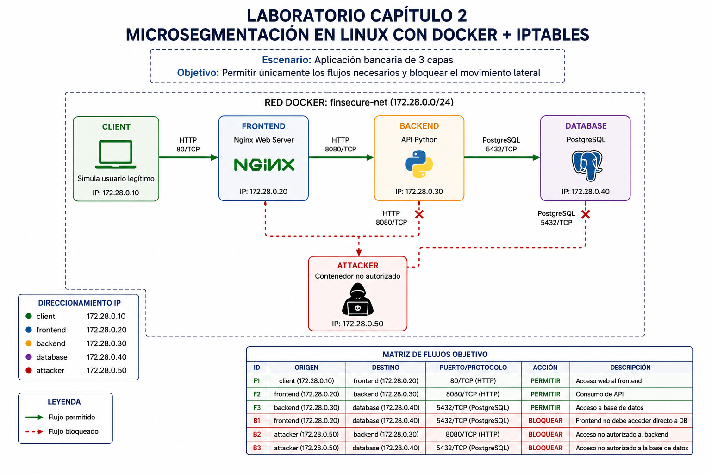

<br>


## Instrucciones
> Para este laboratorio es necesario descargar el contenido de la carpeta **configuración** que se encuentra en este repositorio. 


1. En la carpeta **configuración podremos observar la siguiente estructura de carpetas**

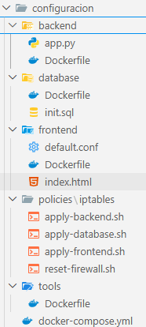


> Nota: en esta carpeta tenemos todos los elementos necesarios para que toda la infraestructura funcione.

2. Direcciones IP del laboratorio:

| Contenedor | Función                            | IP            |
| ---------- | ---------------------------------- | ------------- |
| `client`   | Simula un usuario legítimo         | `172.28.0.10` |
| `frontend` | Servidor web NGINX                 | `172.28.0.20` |
| `backend`  | API Python                         | `172.28.0.30` |
| `database` | PostgreSQL                         | `172.28.0.40` |
| `attacker` | Simula un contenedor no autorizado | `172.28.0.50` |

3. Iniciar el infraestructura completa:

```bash
docker-compose up -d
```

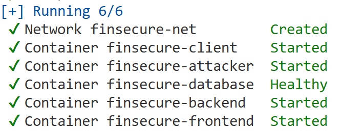


## Validación inicial: red sin microsegmentación

Antes de aplicar las reglas, mostraremos que la red por defecto es demasiado permisiva


1. **Flujo legítimo:** Cliente -> Frontend

```bash
docker compose exec client curl -s http://frontend
```

**Salida esperada**
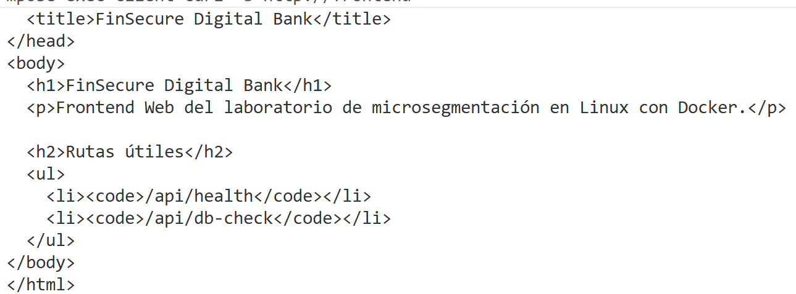

2. **Flujo legítimo:** Cliente -> Frontend -> backend

```bash
docker compose exec client curl -s http://frontend/api/health
```

**Salida esperada**

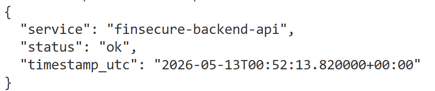

3. **Flujo legítimo completo**: client → frontend → backend → database

```bash
docker compose exec client curl -s http://frontend/api/db-check
```

**Salida esperada**
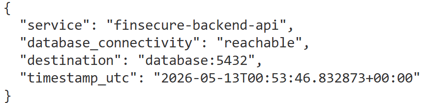

4. **Flujo legítimo:** Frontend -> backend

```bash
docker compose exec frontend curl -s http://backend:8080/health
```

**Salida esperada**
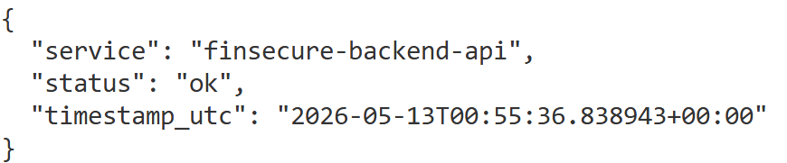


5. **Flujo legítimo directo:** backend -> database

```bash
docker compose exec backend nc -vz database 5432
```

**Salida esperada**
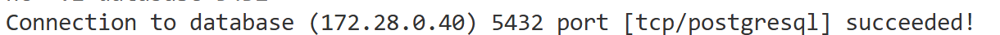

> Nota: Validamos que los flujos esperados funcionan.

## Demostración de riesgos
Estas pruebas deben funcionar antes de aplicar reglas, aunque desde seguridad no deberían de estar permitidas. 

1. **Riesgo**: frontend -> database
```bash
docker compose exec frontend nc -vz database 5432
```

**Salida esperada antes de proteger**
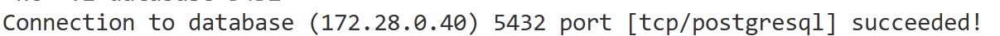

2. **Riesgo**: attacker → backend

```bash
docker compose exec attacker curl -s http://backend:8080/health
```

**Salida esperada antes de proteger**
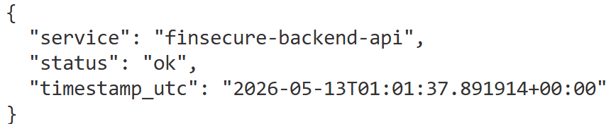


3. **Riesgo**: attacker → database

```bash
docker compose exec attacker nc -vz database 5432
```

**Salida esperada antes de proteger**


## Matriz de flujos objetivo

| Origen     | Destino    |   Puerto | Acción   |
| ---------- | ---------- | -------: | -------- |
| `client`   | `frontend` |   80/TCP | Permitir |
| `frontend` | `backend`  | 8080/TCP | Permitir |
| `backend`  | `database` | 5432/TCP | Permitir |
| `frontend` | `database` | 5432/TCP | Bloquear |
| `attacker` | `backend`  | 8080/TCP | Bloquear |
| `attacker` | `database` | 5432/TCP | Bloquear |


## Reglas de firewall con iptables
iptables permite crear reglas de filtrado de paquetes en Linux y trabajar con cadenas como INPUT, OUTPUT y FORWARD. En este laboratorio protegeremos cada contenedor actuando sobre la cadena INPUT, porque buscamos controlar qué conexiones pueden entrar a cada “host” simulado.


1. Archivo de directivas para reiniciar el firewall, en la carpeta **configuración->policies** hay un archivo llamado **reset-firewall.sh** añadimos el siguiente contenido

```sh
#!/usr/bin/env bash
set -euo pipefail

echo "[+] Restableciendo reglas iptables en $(hostname)..."

iptables -F INPUT || true
iptables -F OUTPUT || true
iptables -F FORWARD || true
iptables -X || true

iptables -P INPUT ACCEPT
iptables -P OUTPUT ACCEPT
iptables -P FORWARD ACCEPT

echo "[+] Firewall restablecido."
iptables -L -n -v
```

**modificar los permisos del archivo (abrir terminal de gitbash)**

```bash
chmod +x policies/iptables/reset-firewall.sh
```


2. Dentro de la misma carpeta **policies** encontraremos al archivo **apply-frontend.sh** añadimos su contenido: 

**apply-frontend.sh**
```sh
#!/usr/bin/env bash
set -euo pipefail

CLIENT_IP="172.28.0.10"

echo "[+] Aplicando reglas iptables en FRONTEND..."

iptables -F INPUT
iptables -F OUTPUT
iptables -F FORWARD
iptables -X || true

iptables -P INPUT DROP
iptables -P OUTPUT ACCEPT
iptables -P FORWARD DROP

# Permitir tráfico local
iptables -A INPUT -i lo -j ACCEPT

# Permitir respuestas de conexiones ya establecidas
iptables -A INPUT -m conntrack --ctstate ESTABLISHED,RELATED -j ACCEPT

# Permitir HTTP únicamente desde client
iptables -A INPUT -p tcp -s "${CLIENT_IP}" --dport 80 \
  -m conntrack --ctstate NEW \
  -j ACCEPT

# Registrar y bloquear intentos no autorizados hacia HTTP
iptables -A INPUT -p tcp --dport 80 \
  -m limit --limit 6/min --limit-burst 6 \
  -j LOG --log-prefix "FRONTEND_HTTP_BLOCKED: " --log-level 4

iptables -A INPUT -p tcp --dport 80 -j DROP

# Registrar y bloquear cualquier otro ingreso
iptables -A INPUT \
  -m limit --limit 6/min --limit-burst 6 \
  -j LOG --log-prefix "FRONTEND_INPUT_DROP: " --log-level 4

iptables -A INPUT -j DROP

echo "[+] Reglas de FRONTEND aplicadas."
iptables -L INPUT -n -v --line-numbers
```

**modificar los permisos del archivo (abrir terminal de gitbash)**

```bash
chmod +x policies/iptables/apply-frontend.sh
```

3. Dentro de la misma carpeta **policies** encontraremos al archivo **apply-backend.sh** añadimos su contenido: 

**apply-backend.sh**
```sh
#!/usr/bin/env bash
set -euo pipefail

FRONTEND_IP="172.28.0.20"

echo "[+] Aplicando reglas iptables en BACKEND..."

iptables -F INPUT
iptables -F OUTPUT
iptables -F FORWARD
iptables -X || true

iptables -P INPUT DROP
iptables -P OUTPUT ACCEPT
iptables -P FORWARD DROP

# Permitir tráfico local
iptables -A INPUT -i lo -j ACCEPT

# Permitir respuestas de conexiones ya establecidas
iptables -A INPUT -m conntrack --ctstate ESTABLISHED,RELATED -j ACCEPT

# Permitir API únicamente desde frontend
iptables -A INPUT -p tcp -s "${FRONTEND_IP}" --dport 8080 \
  -m conntrack --ctstate NEW \
  -j ACCEPT

# Registrar y bloquear intentos no autorizados hacia la API
iptables -A INPUT -p tcp --dport 8080 \
  -m limit --limit 6/min --limit-burst 6 \
  -j LOG --log-prefix "BACKEND_API_BLOCKED: " --log-level 4

iptables -A INPUT -p tcp --dport 8080 -j DROP

# Registrar y bloquear cualquier otro ingreso
iptables -A INPUT \
  -m limit --limit 6/min --limit-burst 6 \
  -j LOG --log-prefix "BACKEND_INPUT_DROP: " --log-level 4

iptables -A INPUT -j DROP

echo "[+] Reglas de BACKEND aplicadas."
iptables -L INPUT -n -v --line-numbers
```

**modificar los permisos del archivo (abrir terminal de gitbash)**

```bash
chmod +x policies/iptables/apply-backend.sh
```

4. Dentro de la misma carpeta **policies** encontraremos al archivo **apply-database.sh** añadimos su contenido: 

```sh
#!/usr/bin/env bash
set -euo pipefail

BACKEND_IP="172.28.0.30"

echo "[+] Aplicando reglas iptables en DATABASE..."

iptables -F INPUT
iptables -F OUTPUT
iptables -F FORWARD
iptables -X || true

iptables -P INPUT DROP
iptables -P OUTPUT ACCEPT
iptables -P FORWARD DROP

# Permitir tráfico local
iptables -A INPUT -i lo -j ACCEPT

# Permitir respuestas de conexiones ya establecidas
iptables -A INPUT -m conntrack --ctstate ESTABLISHED,RELATED -j ACCEPT

# Permitir PostgreSQL únicamente desde backend
iptables -A INPUT -p tcp -s "${BACKEND_IP}" --dport 5432 \
  -m conntrack --ctstate NEW \
  -j ACCEPT

# Registrar y bloquear intentos no autorizados hacia PostgreSQL
iptables -A INPUT -p tcp --dport 5432 \
  -m limit --limit 6/min --limit-burst 6 \
  -j LOG --log-prefix "DATABASE_ACCESS_BLOCKED: " --log-level 4

iptables -A INPUT -p tcp --dport 5432 -j DROP

# Registrar y bloquear cualquier otro ingreso
iptables -A INPUT \
  -m limit --limit 6/min --limit-burst 6 \
  -j LOG --log-prefix "DATABASE_INPUT_DROP: " --log-level 4

iptables -A INPUT -j DROP

echo "[+] Reglas de DATABASE aplicadas."
iptables -L INPUT -n -v --line-numbers
```


**modificar los permisos del archivo (abrir terminal de gitbash)**

```bash
chmod +x policies/iptables/apply-database.sh
```

## Aplicar las políticas

```bash
docker compose exec -u root frontend bash /policies/iptables/apply-frontend.sh
docker compose exec -u root backend bash /policies/iptables/apply-backend.sh
docker compose exec -u root database bash /policies/iptables/apply-database.sh
```

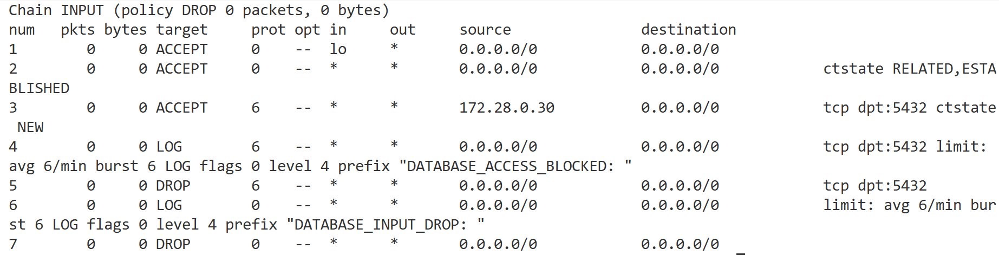

## Validar que los flujos legítimos sigan funcionando

1. **Flujo legítimo:** Cliente -> Frontend

```bash
docker compose exec client curl -s http://frontend
```

**Salida esperada**


2. **Flujo legítimo:** Cliente -> Frontend -> backend

```bash
docker compose exec client curl -s http://frontend/api/health
```

**Salida esperada**


3. **Flujo legítimo completo**: client → frontend → backend → database

```bash
docker compose exec client curl -s http://frontend/api/db-check
```

**Salida esperada**


4. **Flujo legítimo:** Frontend -> backend

```bash
docker compose exec frontend curl -s http://backend:8080/health
```

**Salida esperada**


5. **Flujo legítimo directo:** backend -> database

```bash
docker compose exec backend nc -vz database 5432
```

**Salida esperada**


> Nota: Validamos que los flujos esperados funcionan.


## Validamos los bloqueos

1. **Bloqueo:** frontend -> database

```bash
docker compose exec frontend nc -vz -w 3 database 5432
```

**Resultado esperado (timeout)**
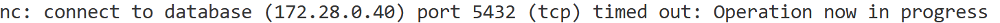


2. **Bloqueo:** attacker -> backend

```bash
docker compose exec attacker curl --max-time 3 -s http://backend:8080/health
```
**Resultado esperado (no responde)**


3. **Bloqueo:** attacker -> database

```bash
docker compose exec attacker nc -vz -w 3 database 5432
```
**Resultado esperado (timeout)**


## Revisar reglas y contadores
Los contadores ayudan a demostrar que una regla fue utilizada. iptables -L -n -v muestra el número de paquetes y bytes que coincidieron con cada regla.

1. Ejecuta los siguientes comandos para validar. 

```bash
docker compose exec -u root frontend iptables -L INPUT -n -v --line-numbers
docker compose exec -u root backend iptables -L INPUT -n -v --line-numbers
docker compose exec -u root database iptables -L INPUT -n -v --line-numbers
```


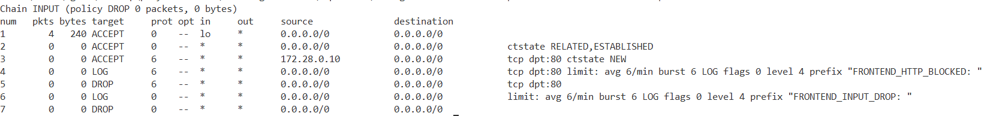


## Resultado esperado
Al final del laboratorio el alumno debería de tener la siguiente tabla de flujos implementada dentro de sus servidores en Docker.

| ID  | Flujo                          | Antes de políticas | Después de políticas |
| --- | ------------------------------ | ------------------ | -------------------- |
| T01 | `client → frontend:80`         | Permitido          | Permitido            |
| T02 | `client → frontend/api/health` | Permitido          | Permitido            |
| T03 | `frontend → backend:8080`      | Permitido          | Permitido            |
| T04 | `backend → database:5432`      | Permitido          | Permitido            |
| T05 | `frontend → database:5432`     | Permitido          | Bloqueado            |
| T06 | `attacker → backend:8080`      | Permitido          | Bloqueado            |
| T07 | `attacker → database:5432`     | Permitido          | Bloqueado            |
