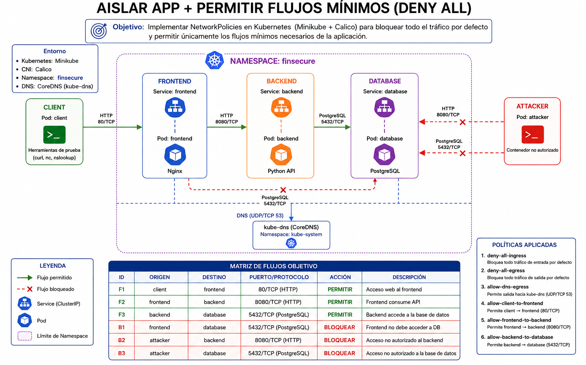
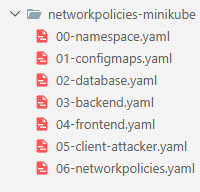
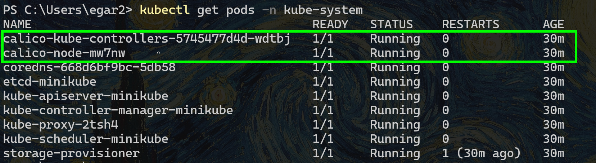
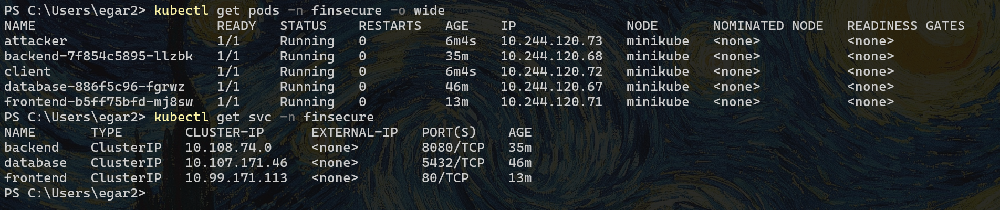
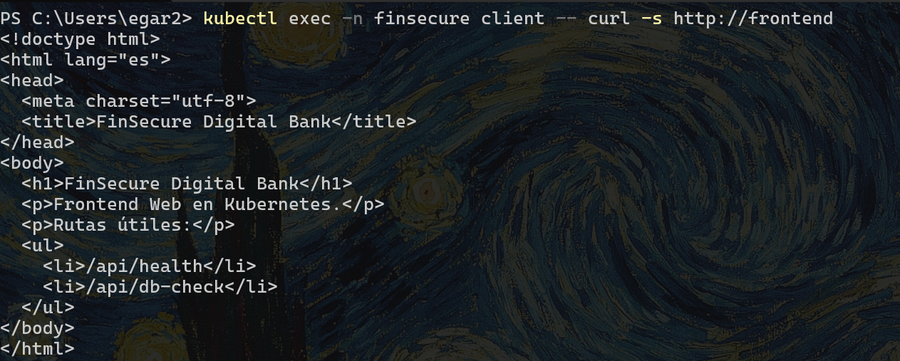
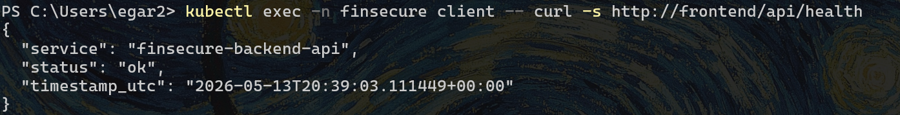
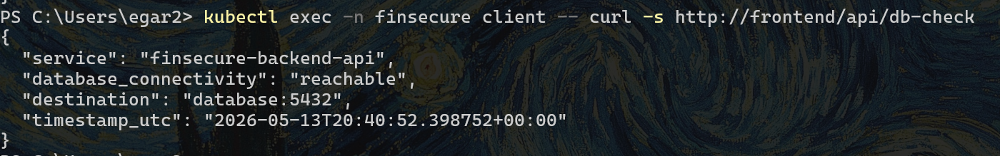
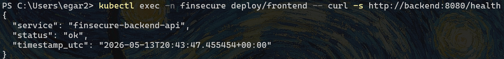
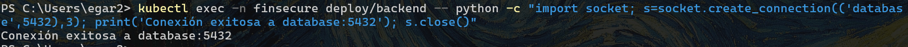
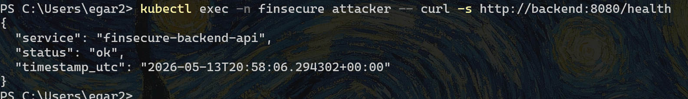

# 3. Aislar app + permitir flujos mínimos con deny all

FinSecure Digital Bank migró su aplicación bancaria a Kubernetes usando Minikube. La aplicación tiene una arquitectura de tres capas:

```bash
client → frontend → backend → database
```

También existe un Pod llamado attacker, que representa un contenedor no autorizado dentro del mismo namespace.

Al inicio, todos los Pods pueden comunicarse entre sí. El objetivo será aplicar NetworkPolicies para implementar un modelo Zero Trust:

- Bloquear todo por defecto
- Permitir únicamente los flujos mínimos necesarios
- Validar accesos permitidos y bloqueados

Las NetworkPolicy permiten controlar tráfico entre Pods a nivel IP/puerto, siempre que el clúster use un plugin de red compatible. Por eso el laboratorio se recomienda con Minikube + Calico.


## Objetivos
- Desplegar aplicación 3 capas en kubernetes
- Validar funcionamiento de aplicación
- Implementar Network Policies para delimitar comunicación con aplicaciones. 


---

<div style="width: 400px;">
        <table width="50%">
            <tr>
                <td style="text-align: center;">
                    <a href="../Capitulo2/"></a>
                    <br>anterior
                </td>
                <td style="text-align: center;">
                   <a href="../README.md">Lista Laboratorios</a>
                </td>
<td style="text-align: center;">
                    <a href="../Capitulo4/"></a>
                    <br>siguiente
                </td>
            </tr>
        </table>
</div>

---


## Diagrama




## Instrucciones

## Estructura de archivos
1.  Crea un directorio donde trabajaremos en este laboratorio:

```bash
mkdir networkpolicies-minikube
cd networkpolicies-minikube
```

2. Crea la siguiente estructura de archivos:


```text
networkpolicies-minikube/
├── 00-namespace.yaml
├── 01-configmaps.yaml
├── 02-database.yaml
├── 03-backend.yaml
├── 04-frontend.yaml
├── 05-client-attacker.yaml
└── 06-networkpolicies.yaml
```



## Preparar Minikube con Calico
>Nota: Es necesario usar calico para la creación de las Network Policies. 

1. Eliminar el clúster si anteriormente ya tenias uno creado. 

```bash
minikube delete --profile=minikube
```

2. Iniciar un nuevo clúster con Calico.  

```bash
minikube start --cni=calico
```

3. Varifica el estado y válida que haya pods de calico. 

```bash
kubectl get pods -n kube-system
```



## Despliegue de Objetos kubernetes

1. Crea el namespace que nos permitirá aislar los objetos del laboratorio. Edita el archivo **00-namespace.yaml** y añade el siguiente contenido:


```yaml
apiVersion: v1
kind: Namespace
metadata:
  name: finsecure
  labels:
    name: finsecure
    env: lab
```

**Crea el objeto con el siguiente comando**
```bash
kubectl apply -f 00-namespace.yaml
```


2. Edita el archivo **01-configmaps.yaml** donde añadiremos:
  - Configuración de nginx para el frontend
  - Código Python del backend

```yaml
apiVersion: v1
kind: ConfigMap
metadata:
  name: frontend-nginx-config
  namespace: finsecure
data:
  default.conf: |
    server {
        listen 80;
        server_name _;

        location / {
            root /usr/share/nginx/html;
            index index.html;
        }

        location /api/ {
            proxy_pass http://backend:8080/;
            proxy_http_version 1.1;
            proxy_set_header Host $host;
            proxy_set_header X-Forwarded-For $proxy_add_x_forwarded_for;
        }
    }
---
apiVersion: v1
kind: ConfigMap
metadata:
  name: frontend-html
  namespace: finsecure
data:
  index.html: |
    <!doctype html>
    <html lang="es">
    <head>
      <meta charset="utf-8">
      <title>FinSecure Digital Bank</title>
    </head>
    <body>
      <h1>FinSecure Digital Bank</h1>
      <p>Frontend Web en Kubernetes.</p>
      <p>Rutas útiles:</p>
      <ul>
        <li>/api/health</li>
        <li>/api/db-check</li>
      </ul>
    </body>
    </html>
---
apiVersion: v1
kind: ConfigMap
metadata:
  name: backend-app
  namespace: finsecure
data:
  app.py: |
    from http.server import BaseHTTPRequestHandler, HTTPServer
    import json
    import socket
    from datetime import datetime, timezone

    HOST = "0.0.0.0"
    PORT = 8080
    DB_HOST = "database"
    DB_PORT = 5432

    class Handler(BaseHTTPRequestHandler):
        def _json(self, status_code: int, payload: dict) -> None:
            body = json.dumps(payload, ensure_ascii=False, indent=2).encode("utf-8")
            self.send_response(status_code)
            self.send_header("Content-Type", "application/json; charset=utf-8")
            self.send_header("Content-Length", str(len(body)))
            self.end_headers()
            self.wfile.write(body)

        def do_GET(self):
            now = datetime.now(timezone.utc).isoformat()

            if self.path in {"/", "/health"}:
                self._json(200, {
                    "service": "finsecure-backend-api",
                    "status": "ok",
                    "timestamp_utc": now
                })
                return

            if self.path == "/db-check":
                try:
                    with socket.create_connection((DB_HOST, DB_PORT), timeout=2):
                        self._json(200, {
                            "service": "finsecure-backend-api",
                            "database_connectivity": "reachable",
                            "destination": f"{DB_HOST}:{DB_PORT}",
                            "timestamp_utc": now
                        })
                except OSError as exc:
                    self._json(503, {
                        "service": "finsecure-backend-api",
                        "database_connectivity": "unreachable",
                        "destination": f"{DB_HOST}:{DB_PORT}",
                        "error": str(exc),
                        "timestamp_utc": now
                    })
                return

            self._json(404, {
                "error": "not_found",
                "path": self.path,
                "timestamp_utc": now
            })

        def log_message(self, fmt, *args):
            print(f"[backend] {self.address_string()} - {fmt % args}", flush=True)

    if __name__ == "__main__":
        server = HTTPServer((HOST, PORT), Handler)
        print(f"[backend] Listening on http://{HOST}:{PORT}", flush=True)
        server.serve_forever()
```


**Crea el objeto con el siguiente comando**
```bash
kubectl apply -f 01-configmaps.yaml
```


3. Crear los objetos para el despliegue de la base de datos **02-database.yaml**, añadir el siguiente contenido:


```yaml
apiVersion: v1
kind: Secret
metadata:
  name: database-secret
  namespace: finsecure
type: Opaque
stringData:
  POSTGRES_DB: finsecure
  POSTGRES_USER: finuser
  POSTGRES_PASSWORD: FinSecureLab2026!
---
apiVersion: apps/v1
kind: Deployment
metadata:
  name: database
  namespace: finsecure
  labels:
    app: database
    tier: data
spec:
  replicas: 1
  selector:
    matchLabels:
      app: database
      tier: data
  template:
    metadata:
      labels:
        app: database
        tier: data
    spec:
      containers:
        - name: database
          image: postgres:16
          ports:
            - containerPort: 5432
          envFrom:
            - secretRef:
                name: database-secret
          readinessProbe:
            exec:
              command:
                - pg_isready
                - -U
                - finuser
                - -d
                - finsecure
            initialDelaySeconds: 10
            periodSeconds: 5
---
apiVersion: v1
kind: Service
metadata:
  name: database
  namespace: finsecure
  labels:
    app: database
spec:
  type: ClusterIP
  selector:
    app: database
    tier: data
  ports:
    - name: postgres
      port: 5432
      targetPort: 5432
      protocol: TCP
```


**Crea el objeto con el siguiente comando**
```bash
kubectl apply -f 02-database.yaml
```

4. Modificar el archivo **03-backend.yaml** y añadir el siguiente contenido: 
>Nota: En este archivo añadiremos la configuración para los objetos que pertenecen al backend y se depliega la app de python. 

```yaml
apiVersion: apps/v1
kind: Deployment
metadata:
  name: backend
  namespace: finsecure
  labels:
    app: backend
    tier: backend
spec:
  replicas: 1
  selector:
    matchLabels:
      app: backend
      tier: backend
  template:
    metadata:
      labels:
        app: backend
        tier: backend
    spec:
      containers:
        - name: backend
          image: python:3.12-slim
          command:
            - sh
            - -c
            - |
              cp /config/app.py /app.py
              python /app.py
          ports:
            - containerPort: 8080
          volumeMounts:
            - name: backend-app
              mountPath: /config
          readinessProbe:
            httpGet:
              path: /health
              port: 8080
            initialDelaySeconds: 5
            periodSeconds: 5
      volumes:
        - name: backend-app
          configMap:
            name: backend-app
---
apiVersion: v1
kind: Service
metadata:
  name: backend
  namespace: finsecure
  labels:
    app: backend
spec:
  type: ClusterIP
  selector:
    app: backend
    tier: backend
  ports:
    - name: http
      port: 8080
      targetPort: 8080
      protocol: TCP
```

**Crea el objeto con el siguiente comando**
```bash
kubectl apply -f 03-backend.yaml
```


5. Modifica el contenido del archivo **04-frontend.yaml**  donde añadiremos la configuración de los objetos para crear el **frontend**


```yaml
apiVersion: apps/v1
kind: Deployment
metadata:
  name: frontend
  namespace: finsecure
  labels:
    app: frontend
    tier: frontend
spec:
  replicas: 1
  selector:
    matchLabels:
      app: frontend
      tier: frontend
  template:
    metadata:
      labels:
        app: frontend
        tier: frontend
    spec:
      containers:
        - name: frontend
          image: nginx:1.27
          ports:
            - containerPort: 80
          volumeMounts:
            - name: nginx-config
              mountPath: /etc/nginx/conf.d/default.conf
              subPath: default.conf
            - name: frontend-html
              mountPath: /usr/share/nginx/html/index.html
              subPath: index.html
          readinessProbe:
            httpGet:
              path: /
              port: 80
            initialDelaySeconds: 5
            periodSeconds: 5
      volumes:
        - name: nginx-config
          configMap:
            name: frontend-nginx-config
        - name: frontend-html
          configMap:
            name: frontend-html
---
apiVersion: v1
kind: Service
metadata:
  name: frontend
  namespace: finsecure
  labels:
    app: frontend
spec:
  type: ClusterIP
  selector:
    app: frontend
    tier: frontend
  ports:
    - name: http
      port: 80
      targetPort: 80
      protocol: TCP
```

**Crea el objeto con el siguiente comando**
```bash
kubectl apply -f 04-frontend.yaml
```


6. Ahora modificar el archivo **05-client-attacker.yaml**  y añadir el siguiente contenido: 

```yaml
apiVersion: v1
kind: Pod
metadata:
  name: client
  namespace: finsecure
  labels:
    app: client
    role: client
spec:
  containers:
    - name: client
      image: nicolaka/netshoot:latest
      command:
        - sleep
        - infinity
---
apiVersion: v1
kind: Pod
metadata:
  name: attacker
  namespace: finsecure
  labels:
    app: attacker
    role: attacker
spec:
  containers:
    - name: attacker
      image: nicolaka/netshoot:latest
      command:
        - sleep
        - infinity
```

**Crea el objeto con el siguiente comando**
```bash
kubectl apply -f 05-client-attacker.yaml
```

## Validar despliegue de la aplicación

1. Ejecutar los siguientes comando para validar que están los pods ejecutandose:

```bash
kubectl get pods -n finsecure -o wide
kubectl get svc -n finsecure
```



2. Esperar a que todos los pods estén en estado de Running.


## Pruebas antes de aplicar NetworkPolicies. 
Antes de crear políticas, el namespace está abierto. En muchos clústeres, si no hay NetworkPolicies aplicadas a un Pod, la comunicación interna queda permitida por defecto. Las políticas aíslan tráfico cuando seleccionan Pods y definen reglas permitidas.

1. **Flujo legítimo:** Cliente -> Frontend

```bash
kubectl exec -n finsecure client -- curl -s http://frontend
```

**Salida (html)**



2. **Flujo legítimo:** Cliente -> Frontend -> backend

```bash
kubectl exec -n finsecure client -- curl -s http://frontend/api/health
```


**Salida (Respuesta API)**



3. **Flujo legítimo completo:** Cliente -> Frontend -> Backend -> Database

```bash
kubectl exec -n finsecure client -- curl -s http://frontend/api/db-check
```

**Salida (Respuesta API)**


4. **Flujo legítimo:** frontend->backend

```bash
kubectl exec -n finsecure deploy/frontend -- curl -s http://backend:8080/health
```

**Salida (Respuesta API)**



5. **Flujo legítimo:** Backend -> Database

```bash
kubectl exec -n finsecure deploy/backend -- python -c "import socket; s=socket.create_connection(('database',5432),3); print('Conexión exitosa a database:5432'); s.close()"
```

**Salida (Response Database)**



## Flujos con riesgo. 
Estas pruebas deberían funcionar antes de aplicar políticas, aunque desde seguridad son riesgosas.

1. **Riesgo:** Frontend -> database
Simulamos un flujo con origen de frontend creamos un pod  de diagnostico:

```bash
kubectl run frontend-debug `
  -n finsecure `
  --image=nicolaka/netshoot:latest `
  --labels="app=frontend,role=debug" `
  --command -- sleep infinity
```

**Validamos**
```bash
kubectl exec -n finsecure frontend-debug -- nc -vz database 5432
```

**Salida (Database response)**


2. **Riesgo:** attacker -> backend

```bash
kubectl exec -n finsecure frontend-debug -- nc -vz database 5432
```

**Salida (API response)**



3. **Riesgo:** attacker -> database

```bash
kubectl exec -n finsecure attacker -- nc -vz database 5432
```

**Salida (Response database)**


## Implementar Network Policies
La siguiente configuración implementa:

- deny-all-ingress
- deny-all-egress
- Permitir DNS
- Permitir client → frontend
- Permitir frontend → backend
- Permitir backend → database

1. Editar el archivo **06-networkpolicies.yaml** donde añadimos la siguiente configuración:

```yaml
apiVersion: networking.k8s.io/v1
kind: NetworkPolicy
metadata:
  name: deny-all-ingress
  namespace: finsecure
spec:
  podSelector: {}
  policyTypes:
    - Ingress
---
apiVersion: networking.k8s.io/v1
kind: NetworkPolicy
metadata:
  name: deny-all-egress
  namespace: finsecure
spec:
  podSelector: {}
  policyTypes:
    - Egress
---
apiVersion: networking.k8s.io/v1
kind: NetworkPolicy
metadata:
  name: allow-dns-egress
  namespace: finsecure
spec:
  podSelector: {}
  policyTypes:
    - Egress
  egress:
    - to:
        - namespaceSelector:
            matchLabels:
              kubernetes.io/metadata.name: kube-system
          podSelector:
            matchLabels:
              k8s-app: kube-dns
      ports:
        - protocol: UDP
          port: 53
        - protocol: TCP
          port: 53
---
apiVersion: networking.k8s.io/v1
kind: NetworkPolicy
metadata:
  name: allow-client-to-frontend
  namespace: finsecure
spec:
  podSelector:
    matchLabels:
      app: frontend
  policyTypes:
    - Ingress
  ingress:
    - from:
        - podSelector:
            matchLabels:
              app: client
      ports:
        - protocol: TCP
          port: 80
---
apiVersion: networking.k8s.io/v1
kind: NetworkPolicy
metadata:
  name: allow-client-egress-to-frontend
  namespace: finsecure
spec:
  podSelector:
    matchLabels:
      app: client
  policyTypes:
    - Egress
  egress:
    - to:
        - podSelector:
            matchLabels:
              app: frontend
      ports:
        - protocol: TCP
          port: 80
---
apiVersion: networking.k8s.io/v1
kind: NetworkPolicy
metadata:
  name: allow-frontend-to-backend-ingress
  namespace: finsecure
spec:
  podSelector:
    matchLabels:
      app: backend
  policyTypes:
    - Ingress
  ingress:
    - from:
        - podSelector:
            matchLabels:
              app: frontend
      ports:
        - protocol: TCP
          port: 8080
---
apiVersion: networking.k8s.io/v1
kind: NetworkPolicy
metadata:
  name: allow-frontend-egress-to-backend
  namespace: finsecure
spec:
  podSelector:
    matchLabels:
      app: frontend
  policyTypes:
    - Egress
  egress:
    - to:
        - podSelector:
            matchLabels:
              app: backend
      ports:
        - protocol: TCP
          port: 8080
---
apiVersion: networking.k8s.io/v1
kind: NetworkPolicy
metadata:
  name: allow-backend-to-database-ingress
  namespace: finsecure
spec:
  podSelector:
    matchLabels:
      app: database
  policyTypes:
    - Ingress
  ingress:
    - from:
        - podSelector:
            matchLabels:
              app: backend
      ports:
        - protocol: TCP
          port: 5432
---
apiVersion: networking.k8s.io/v1
kind: NetworkPolicy
metadata:
  name: allow-backend-egress-to-database
  namespace: finsecure
spec:
  podSelector:
    matchLabels:
      app: backend
  policyTypes:
    - Egress
  egress:
    - to:
        - podSelector:
            matchLabels:
              app: database
      ports:
        - protocol: TCP
          port: 5432
```

**Crear los objetos con el siguiente comando**

```bash
kubectl apply -f 06-networkpolicies.yaml
```

## Volver a validar los accesos permitidos
1. **Flujo legítimo:** Cliente -> Frontend

```bash
kubectl exec -n finsecure client -- curl -s http://frontend
```

**Salida (html)**


2. **Flujo legítimo:** Cliente -> Frontend -> backend

```bash
kubectl exec -n finsecure client -- curl -s http://frontend/api/health
```


**Salida (Respuesta API)**


3. **Flujo legítimo completo:** Cliente -> Frontend -> Backend -> Database

```bash
kubectl exec -n finsecure client -- curl -s http://frontend/api/db-check
```

**Salida (Respuesta API)**


4. **Flujo legítimo:** frontend->backend

```bash
kubectl exec -n finsecure deploy/frontend -- curl -s http://backend:8080/health
```

**Salida (Respuesta API)**


5. **Flujo legítimo:** Backend -> Database

```bash
kubectl exec -n finsecure deploy/backend -- python -c "import socket; s=socket.create_connection(('database',5432),3); print('Conexión exitosa a database:5432'); s.close()"
```

**Salida (Response Database)**


## Validar Bloqueos

1. **Bloqueo:** Frontend -> database
Simulamos un flujo con origen de frontend creamos un pod  de diagnostico:

```bash
kubectl run frontend-debug `
  -n finsecure `
  --image=nicolaka/netshoot:latest `
  --labels="app=frontend,role=debug" `
  --command -- sleep infinity
```

**Validamos**
```bash
kubectl exec -n finsecure frontend-debug -- nc -vz database 5432
```

**Salida (timeout)**


2. **Bloqueo:** attacker -> backend

```bash
kubectl exec -n finsecure attacker -- curl -s http://backend:8080/health
```

**Salida (timeout)**


3. **Bloqueo:** attacker -> database

```bash
kubectl exec -n finsecure attacker -- nc -vz database 5432
```

**Salida (no response)**


## Resultado esperado 

Al final del laboratorio se debe de tener la siguiente matriz de validación:

| ID  | Flujo                            | Antes de políticas | Después de políticas |
| --- | -------------------------------- | ------------------ | -------------------- |
| T01 | `client → frontend:80`           | Permitido          | Permitido            |
| T02 | `client → frontend/api/health`   | Permitido          | Permitido            |
| T03 | `client → frontend/api/db-check` | Permitido          | Permitido            |
| T04 | `frontend → backend:8080`        | Permitido          | Permitido            |
| T05 | `backend → database:5432`        | Permitido          | Permitido            |
| T06 | `frontend → database:5432`       | Permitido          | Bloqueado            |
| T07 | `attacker → backend:8080`        | Permitido          | Bloqueado            |
| T08 | `attacker → database:5432`       | Permitido          | Bloqueado            |
| T09 | `client → DNS`                   | Permitido          | Permitido            |
| T10 | `backend → DNS`                  | Permitido          | Permitido            |
