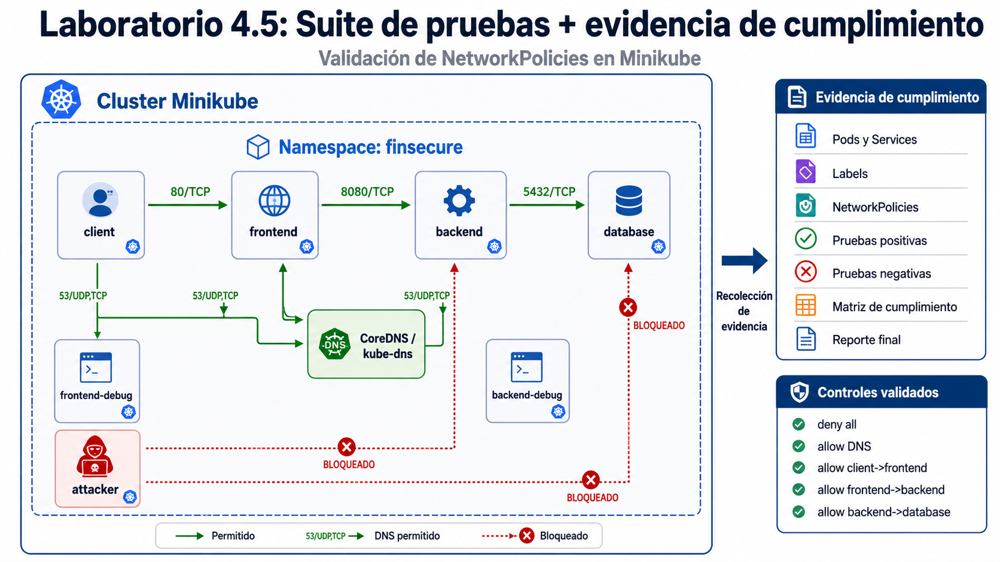
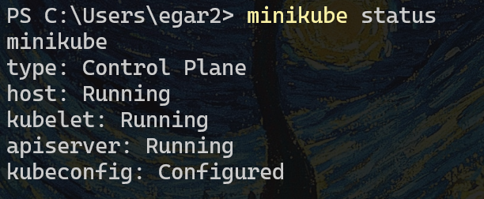
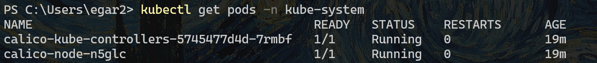
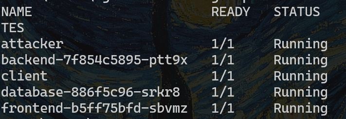
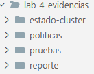
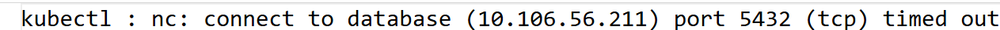
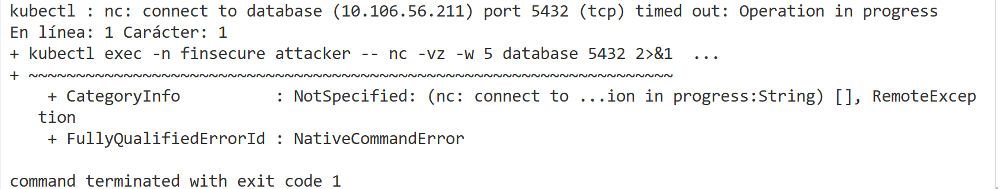
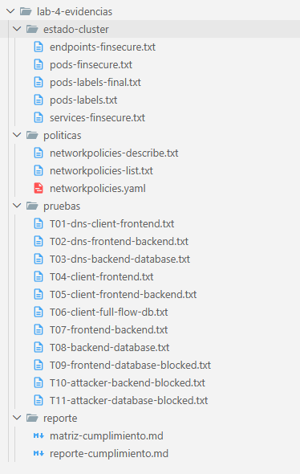

# 4. Suite de pruebas + evidencia de cumplimiento

Después de implementar las NetworkPolicies en la aplicación de FinSecure Digital Bank, el equipo de Seguridad solicita una validación formal de los controles de microsegmentación.

No basta con afirmar que las políticas están aplicadas. Se necesita generar evidencia técnica que demuestre que:

- Los flujos necesarios para la aplicación continúan funcionando.
- Los accesos no autorizados están bloqueados.
- DNS interno sigue operando.
- Las políticas aplicadas corresponden con el diseño Zero Trust.
- Se redujo el movimiento lateral dentro del namespace.

Este laboratorio simula una actividad de verificación de cumplimiento y pruebas de seguridad operativa sobre el clúster Kubernetes trabajado en el laboratorio anterior.


## Objetivos
- Ejecutar una suite de pruebas positivas y negativas
- Validar que los flujos permitidos continuan operando
- Confirmar que los flujos no autorizados son bloqueados
- Construir una matriz de cumplimiento con resultados verificables.


---

<div style="width: 400px;">
        <table width="50%">
            <tr>
                <td style="text-align: center;">
                    <a href="../Capitulo3/"></a>
                    <br>anterior
                </td>
                <td style="text-align: center;">
                   <a href="../README.md">Lista Laboratorios</a>
                </td>
<td style="text-align: center;">
                    <a href="../Capitulo5/"></a>
                    <br>siguiente
                </td>
            </tr>
        </table>
</div>

---

## Diagrama




## Instrucciones


## Punto de partida
Este laboratorio continua directamente sobre el Laboratorio 3.6

Debes de contar con:
- Minikube activo con Calico.
- Namespace finsecure.
- Aplicación desplegada:
  - frontend
  - backend
  - database
  - client
  - attacker
- NetworkPolicies aplicadas:
  - deny-all-ingress
  - deny-all-egress
  - allow-dns-egress
  - allow-client-to-frontend
  - allow-client-egress-to-frontend
  - allow-frontend-to-backend-ingress
  - allow-frontend-egress-to-backend
  - allow-backend-to-database-ingress
  - allow-backend-egress-to-database


## Validar que minikube este disponible y cluster funcionando

1. Comando para ver disponibilidad de minikube:

```bash
minikube status
```




2. Confirmar que el clúster usa Calico

```bash
kubectl get pods -n kube-system
```



3. Validar que el namespace existe

```bash
kubectl get namespace finsecure
```


4. Confirmar el estado de la aplicación

```bash
kubectl get pods -n finsecure -o wide
```




## Crear carpeta local de evidencias

1. Crear las siguientes carpetas donde almacenaremos las evidencias.

```bash
mkdir lab-4-evidencias
cd lab-4-evidencias
mkdir estado-cluster
mkdir politicas
mkdir pruebas
mkdir reporte
```




## Guardar evidencias del estado del clúster

1. Evidencia de pods

```bash
kubectl get pods -n finsecure -o wide | Out-File estado-cluster/pods-finsecure.txt
```

2. Evidencias de Services

```bash
kubectl get svc -n finsecure -o wide | Out-File estado-cluster/services-finsecure.txt
```

3. Evidencias de Endpoints

```bash
kubectl get endpoints -n finsecure | Out-File estado-cluster/endpoints-finsecure.txt
```

4. Evidencia de Labels en Pods

```bash
kubectl get pods -n finsecure --show-labels | Out-File estado-cluster/pods-labels.txt
```

5. Evidencia de NetworkPolicies

```bash
kubectl get networkpolicy -n finsecure | Out-File politicas/networkpolicies-list.txt
```

6. Guarda detalle de las políticas

```bash
kubectl describe networkpolicy -n finsecure | Out-File politicas/networkpolicies-describe.txt
```

7. Exportar políticas en YAML

```bash
kubectl get networkpolicy -n finsecure -o yaml | Out-File politicas/networkpolicies.yaml
```


## Crear Pods de diagnóstico
Para ejecutar las pruebas de forma controlada, usaremos Pods temporales basados en netshoot, pero con las mismas labels que usan las políticas.

1. Crear un Pod frontend-debug

```bash
kubectl run frontend-debug `
  -n finsecure `
  --image=nicolaka/netshoot:latest `
  --labels="app=frontend,role=debug" `
  --command -- sleep infinity
```

2. Crear Pod backend-debug

```bash
kubectl run backend-debug `
  -n finsecure `
  --image=nicolaka/netshoot:latest `
  --labels="app=backend,role=debug" `
  --command -- sleep infinity
```

3. Esperar que se encuentren listos:

```bash
kubectl wait --for=condition=Ready pod/frontend-debug -n finsecure --timeout=120s
kubectl wait --for=condition=Ready pod/backend-debug -n finsecure --timeout=120s
```

## Validar DNS
Como en el laboratorio anterior aplicamos deny-all-egress, es indispensable demostrar que la política allow-dns-egress mantiene la resolución de nombres.

1. **DNS** desde client

```bash
kubectl exec -n finsecure client -- nslookup frontend | Out-File pruebas/T01-dns-client-frontend.txt
```


2. **DNS** desde frontend

```bash
kubectl exec -n finsecure frontend-debug -- nslookup backend | Out-File pruebas/T02-dns-frontend-backend.txt
```

3. **DNS** desde backend-debug

```bash
kubectl exec -n finsecure backend-debug -- nslookup database | Out-File pruebas/T03-dns-backend-database.txt
```

## Ejecutar pruebas positivas
Las pruebas positivas demuestran que la aplicación conserva sus flujos necesarios.

1. Client->frontend

```bash
kubectl exec -n finsecure client -- curl -s --max-time 5 http://frontend | Out-File pruebas/T04-client-frontend.txt
```

2. Client->frontend->backend

```bash
kubectl exec -n finsecure client -- curl -s --max-time 5 http://frontend/api/health | Out-File pruebas/T05-client-frontend-backend.txt
```

3. Client->frontend->backend->database

```bash
kubectl exec -n finsecure client -- curl -s --max-time 5 http://frontend/api/db-check | Out-File pruebas/T06-client-full-flow-db.txt
```

4. frontend-debug->backend

```bash
kubectl exec -n finsecure frontend-debug -- curl -s --max-time 5 http://backend:8080/health | Out-File pruebas/T07-frontend-backend.txt
```

5. backend-debug ->database

```bash
kubectl exec -n finsecure backend-debug -- nc -vz -w 5 database 5432 2>&1 | Out-File pruebas/T08-backend-database.txt
```

## Ejecutar pruebas negativas
Las pruebas negativas demuestran que la microsegmentación realmente bloquea movimiento lateral.

1. frontend-debug -> database

```bash
kubectl exec -n finsecure frontend-debug -- nc -vz -w 5 database 5432 2>&1 | Out-File pruebas/T09-frontend-database-blocked.txt
```


2. attacker -> backend

```bash
kubectl exec -n finsecure attacker -- curl --max-time 5 -s http://backend:8080/health 2>&1 | Out-File pruebas/T10-attacker-backend-blocked.txt
```

3. attacker -> database

```bash
kubectl exec -n finsecure attacker -- nc -vz -w 5 database 5432 2>&1 | Out-File pruebas/T11-attacker-database-blocked.txt
```


## Revisar los resultados en pantalla

1. Mostrar un archivo de evidencia:

```bash
Get-Content pruebas/T11-attacker-database-blocked.txt
```




## Crear matriz de cumplimiento

1. Crear un archivo **Markdown**

```bash
New-Item reporte/matriz-cumplimiento.md
```

2. Añadir el siguiente contenido, lo puedes modificar con tus propias anotaciones:

| ID | Flujo validado | Tipo de prueba | Resultado esperado | Resultado obtenido | Estado |
|---|---|---|---|---|---|
| T01 | client → DNS frontend | Positiva | Resuelve nombre | | |
| T02 | frontend-debug → DNS backend | Positiva | Resuelve nombre | | |
| T03 | backend-debug → DNS database | Positiva | Resuelve nombre | | |
| T04 | client → frontend | Positiva | Permitido | | |
| T05 | client → frontend → backend | Positiva | Permitido | | |
| T06 | client → frontend → backend → database | Positiva | Permitido | | |
| T07 | frontend-debug → backend | Positiva | Permitido | | |
| T08 | backend-debug → database | Positiva | Permitido | | |
| T09 | frontend-debug → database | Negativa | Bloqueado | | |
| T10 | attacker → backend | Negativa | Bloqueado | | |
| T11 | attacker → database | Negativa | Bloqueado | | |


## Crear reporte de evidencia

1. Crear el reporte

```bash
New-Item reporte/reporte-cumplimiento.md
```

2. Añadir el siguiente contenido

```md
# Reporte de cumplimiento - Microsegmentación en Kubernetes

## 1. Escenario

La aplicación FinSecure Digital Bank se encuentra desplegada en Kubernetes dentro del namespace `finsecure`, con una arquitectura de tres capas: frontend, backend y base de datos.

Se aplicaron NetworkPolicies bajo un modelo deny all para permitir únicamente los flujos mínimos necesarios.

## 2. Evidencia recolectada

Se almacenaron evidencias de:

- Estado de Pods
- Services y Endpoints
- Labels de selección
- NetworkPolicies aplicadas
- Pruebas positivas
- Pruebas negativas

## 3. Resultados principales

### Flujos permitidos confirmados

- client → frontend
- frontend → backend
- backend → database
- resolución DNS interna

### Flujos bloqueados confirmados

- frontend → database
- attacker → backend
- attacker → database

## 4. Conclusión

Las pruebas demuestran que la microsegmentación conserva la operación legítima de la aplicación y bloquea accesos no autorizados que podrían facilitar movimiento lateral dentro del clúster.
```


## Guardar evidencia de los Pods de diagnóstico

```bash
kubectl get pods -n finsecure --show-labels | Out-File estado-cluster/pods-labels-final.txt
```
2. Eliminar los pods de diagnóstico

```bash
kubectl delete pod frontend-debug -n finsecure
kubectl delete pod backend-debug -n finsecure
```


## Resultado Esperado 

Al final del laboratorio se espera que se tenga la siguiente estructura de reportes.

