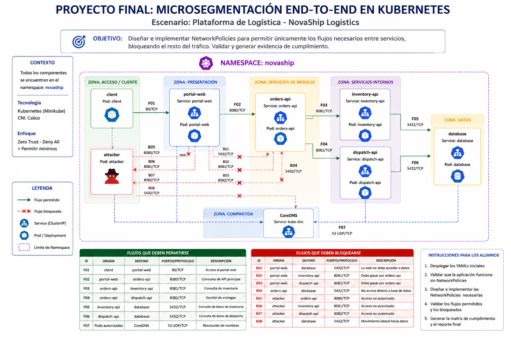
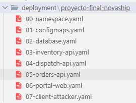
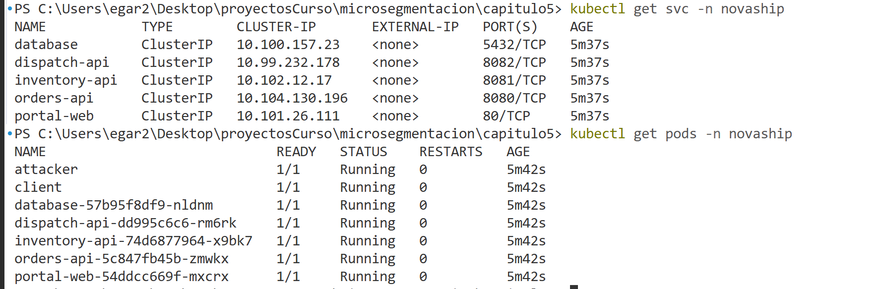
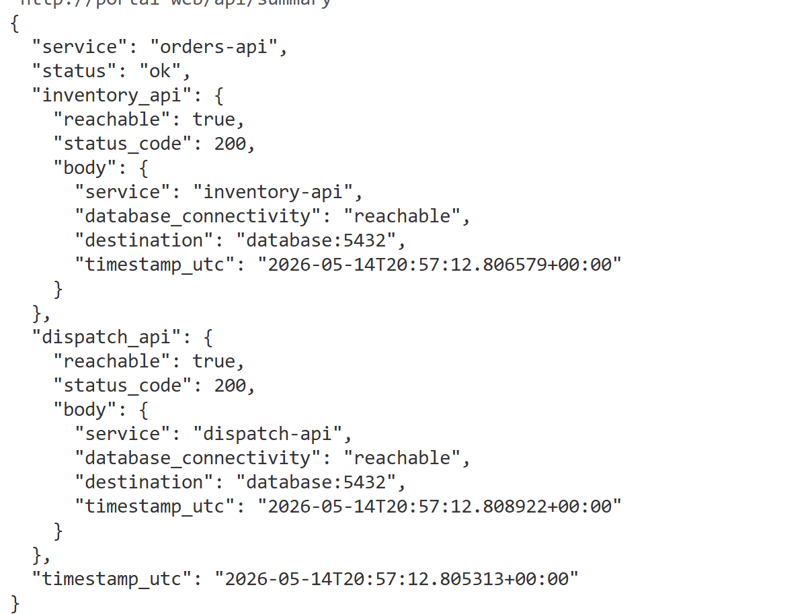

# 5. Proyecto Final: Microsegmentación End-to-End de una plataforma de logística en Kubernetes


## Objetivos
Diseñar, implementar y validar una estrategia de microsegmentación en Kubernetes que permita únicamente los flujos necesarios de una plataforma de logística, reduciendo el riesgo de movimiento lateral dentro del clúster.

---
<div style="width: 400px;">
        <table width="50%">
            <tr>
                <td style="text-align: center;">
                    <a href="../Capitulo4/"></a>
                    <br>anterior
                </td>
                <td style="text-align: center;">
                   <a href="../README.md">Lista Laboratorios</a>
                </td>
<td style="text-align: center;">
                    <a href="../Capitulo6/"></a>
                    <br>siguiente
                </td>
            </tr>
        </table>
</div>

---

## Diagrama




## Escenario del proyecto
La empresa NovaShip Logistics ofrece una plataforma interna para gestionar pedidos, consultar inventario y coordinar entregas.

La solución ha sido migrada a Kubernetes y está compuesta por varios servicios internos. Durante una revisión de seguridad, se detectó que los Pods pueden comunicarse entre sí sin restricciones claras, lo que representa un riesgo si un componente expuesto o un Pod no autorizado es comprometido.

El equipo de Seguridad solicita implementar una estrategia de microsegmentación con enfoque Zero Trust, aplicando:

- Aislamiento por defecto.
- Permisos mínimos entre servicios.
- Control de tráfico ingress y egress.
- Validación de accesos permitidos y bloqueados.
- Evidencia técnica de cumplimiento.

## Proyecto final curso Microsegmentación

## Estructura inicial del proyecto
1. Dentro de la carpeta **deployment** tenemos la siguiente estructura de archivos:




>Nota: Cada archivo ya contiene la configuración inicial de cada objeto de kubernetes.

2. En cada archivo encontramos:

| Archivo YAML              | Descripción del contenido                                                                                                                                                                                                                                           |
| ------------------------- | ------------------------------------------------------------------------------------------------------------------------------------------------------------------------------------------------------------------------------------------------------------------- |
| `00-namespace.yaml`       | Crea el **namespace `novaship`**, que será el espacio lógico donde se desplegarán todos los componentes del proyecto final. También agrega etiquetas para identificar que pertenece al entorno del proyecto.                                                        |
| `01-configmaps.yaml`      | Contiene la **configuración y el código fuente de la aplicación**. Incluye el HTML del portal web, la configuración de NGINX para redirigir peticiones a `orders-api`, y el código Python de las APIs `orders-api`, `inventory-api` y `dispatch-api`.               |
| `02-database.yaml`        | Despliega la **base de datos PostgreSQL**. Incluye un `Secret` con las credenciales, un `Deployment` para ejecutar el contenedor de PostgreSQL y un `Service` interno llamado `database` que expone el puerto `5432/TCP`.                                           |
| `03-inventory-api.yaml`   | Despliega el servicio **`inventory-api`**, encargado de representar las consultas de inventario. Incluye un `Deployment` que ejecuta la API en Python y un `Service` interno que la expone por el puerto `8081/TCP`.                                                |
| `04-dispatch-api.yaml`    | Despliega el servicio **`dispatch-api`**, encargado de representar la coordinación de entregas. Incluye un `Deployment` que ejecuta la API en Python y un `Service` interno que la expone por el puerto `8082/TCP`.                                                 |
| `05-orders-api.yaml`      | Despliega el servicio **`orders-api`**, que actúa como API principal de negocio. Este servicio consulta a `inventory-api` y `dispatch-api`. El archivo contiene su `Deployment` y un `Service` interno expuesto por `8080/TCP`.                                     |
| `06-portal-web.yaml`      | Despliega el **portal web `portal-web`** basado en NGINX. Monta el HTML y la configuración almacenados en los ConfigMaps, y expone un `Service` interno por el puerto `80/TCP`. También funciona como punto de entrada hacia `orders-api` mediante la ruta `/api/`. |
| `07-client-attacker.yaml` | Crea dos Pods de pruebas basados en `netshoot`: **`client`**, que simula un consumidor legítimo de la aplicación, y **`attacker`**, que simula un origen no autorizado para validar posteriormente los bloqueos de microsegmentación.                               |


3. Desplegar todos los archivos con el comando

```bash
kubectl apply -f . 
```

4. Validar que todo esté listo

```bash
kubectl get pods -n novaship
kubectl get svc -n novaship
```



5. **Prueba funcional de la aplicación**

```bash
kubectl exec -n novaship client -- curl -s http://portal-web/api/summary
```




## Requerimientos del proyecto

1. Se deben de implementar NetworkPolicies para evitar el movimiento lateral entre elementos que no deberían comunicarse. 

2. **Plataforma a proteger**

| Componente      | Función                                                     |
| --------------- | ----------------------------------------------------------- |
| `client`        | Pod de pruebas que simula a un usuario autorizado           |
| `portal-web`    | Interfaz web para consultar pedidos                         |
| `orders-api`    | API principal para procesar solicitudes del portal          |
| `inventory-api` | Servicio interno para consultar disponibilidad de productos |
| `dispatch-api`  | Servicio interno para coordinar envíos                      |
| `database`      | Base de datos de la plataforma                              |
| `attacker`      | Pod no autorizado para probar movimiento lateral            |
| `CoreDNS`       | Resolución de nombres dentro del clúster                    |


2. **Zonas de seguridad propuestas**

| Componente      | Función                                                     |
| --------------- | ----------------------------------------------------------- |
| `client`        | Pod de pruebas que simula a un usuario autorizado           |
| `portal-web`    | Interfaz web para consultar pedidos                         |
| `orders-api`    | API principal para procesar solicitudes del portal          |
| `inventory-api` | Servicio interno para consultar disponibilidad de productos |
| `dispatch-api`  | Servicio interno para coordinar envíos                      |
| `database`      | Base de datos de la plataforma                              |
| `attacker`      | Pod no autorizado para probar movimiento lateral            |
| `CoreDNS`       | Resolución de nombres dentro del clúster                    |


3. Flujos que deben de permitirse

| ID  | Origen           | Destino         | Puerto | Protocolo | Justificación                   |
| --- | ---------------- | --------------- | -----: | --------- | ------------------------------- |
| F01 | `client`         | `portal-web`    |     80 | TCP       | Acceso a la interfaz            |
| F02 | `portal-web`     | `orders-api`    |   8080 | TCP       | Consumo de API principal        |
| F03 | `orders-api`     | `inventory-api` |   8081 | TCP       | Consulta de inventario          |
| F04 | `orders-api`     | `dispatch-api`  |   8082 | TCP       | Gestión de entregas             |
| F05 | `inventory-api`  | `database`      |   5432 | TCP       | Consulta de datos de inventario |
| F06 | `dispatch-api`   | `database`      |   5432 | TCP       | Consulta de datos de despacho   |
| F07 | Pods autorizados | CoreDNS         |     53 | UDP/TCP   | Resolución de nombres           |


4. Flujos que deben de Bloquearse

| ID  | Origen       | Destino         | Puerto | Justificación                                    |
| --- | ------------ | --------------- | -----: | ------------------------------------------------ |
| B01 | `portal-web` | `database`      |   5432 | La capa web no debe consultar datos directamente |
| B02 | `portal-web` | `inventory-api` |   8081 | Debe pasar por `orders-api`                      |
| B03 | `portal-web` | `dispatch-api`  |   8082 | Debe pasar por `orders-api`                      |
| B04 | `orders-api` | `database`      |   5432 | No debe saltarse servicios internos              |
| B05 | `attacker`   | `orders-api`    |   8080 | Acceso no autorizado                             |
| B06 | `attacker`   | `inventory-api` |   8081 | Acceso no autorizado                             |
| B07 | `attacker`   | `dispatch-api`  |   8082 | Acceso no autorizado                             |
| B08 | `attacker`   | `database`      |   5432 | Movimiento lateral hacia datos                   |


## Entregable
1. Al final el alumno debe de crear un reporte de evidencias (Cómo el creado en el capítulo 4).

2. Se debe de entregar en un archivo .zip

3. Enviar al instructor el reporte de evidencias:
  - email instructor.
  - subject: nombre_alumno_microsegmentación
  - body: archivo .zip con el reporte


## Resultado Esperado 

Se espera que el alumno envíe el reporte de microsegmentación en un archivo .zip


