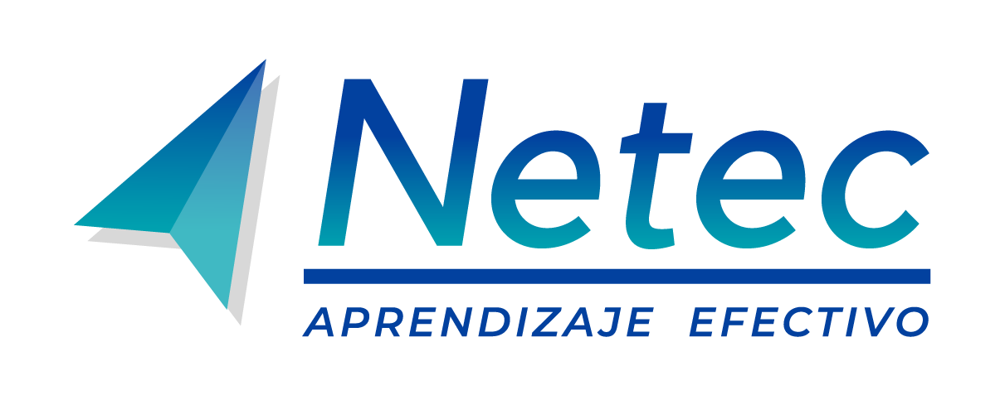

<table>
  <tbody>
      <tr>
    <td> 
        
    <td>
    <td>
      <h1>Microsegmentación y Zero Trust<h1>
    </td>
  </tr>
  </tbody>
<table>

**Plataforma de Laboratorios**
Bienvenido a la **Plataforma de Laboratorios** del curso **Microsegmentación y Zero Trust**. Aquí podrás explorar diferentes tecnologías a través de prácticas guiadas. ¡Desarrolla tus habilidades y lleva tus conocimientos al siguiente nivel!

# Lista de Laboratorios
Cada uno de estos laboratorios está diseñado para ofrecerte una experiencia práctica. Haz clic en los enlaces para comenzar.

01. ### [Mapeo de flujos y diseño de políticas objetivo](./Capitulo1/README.md)
    - **Descripción**: Definir el análisis de flujos y diseñar políticas objetivo antes de cualquier implementación en Kubernetes o Linux
    - ⏱️ **Duración estimada**: 40 min

02. ### [Microsegmentación en Linux con Docker e iptables](./Capitulo2/README.md)
    - **Descripción**: El equipo de Seguridad solicita implementar un modelo básico de microsegmentación a nivel host usando firewalls Linux, de forma que solo se permitan los flujos estrictamente necesarios.

    - ⏱️ **Duración estimada**: 60 min

03. ### [Aislar app + permitir flujos mínimos con deny all](./Capitulo3/README.md)
    - **Descripción**: Definir Network policies en Kubernetes para una aplicación 3 capas.

    - ⏱️**Duración estimada**: 155 min

04. ### [Suite de pruebas + evidencia de cumplimiento](./Capitulo4/README.md)
    - **Descripción**: Este laboratorio simula una actividad de verificación de cumplimiento y pruebas de seguridad operativa sobre el clúster Kubernetes trabajado en el laboratorio anterior.
    - ⏱️**Duración estimada**: 110 min

05. ### [Microsegmentación End-to-End de una plataforma de logística en Kubernetes](./Capitulo5/README.md)
    - **Descripción**: Diseñar, implementar y validar una estrategia de microsegmentación en Kubernetes que permita únicamente los flujos necesarios de una plataforma de logística, reduciendo el riesgo de movimiento lateral dentro del clúster.
    - ⏱️**Duración estimada**: 40 min

---
## 📬 **Contacto y Más Información**

Si tienes alguna pregunta o necesitas más detalles, no dudes en [contactarnos](mailto:soporte@netec.com). También puedes encontrar más recursos en nuestra [página de recursos](https://netec.com).

---

¡Gracias por visitar nuestra plataforma! No olvides revisar todos los laboratorios y comenzar tu viaje de aprendizaje hoy mismo.
